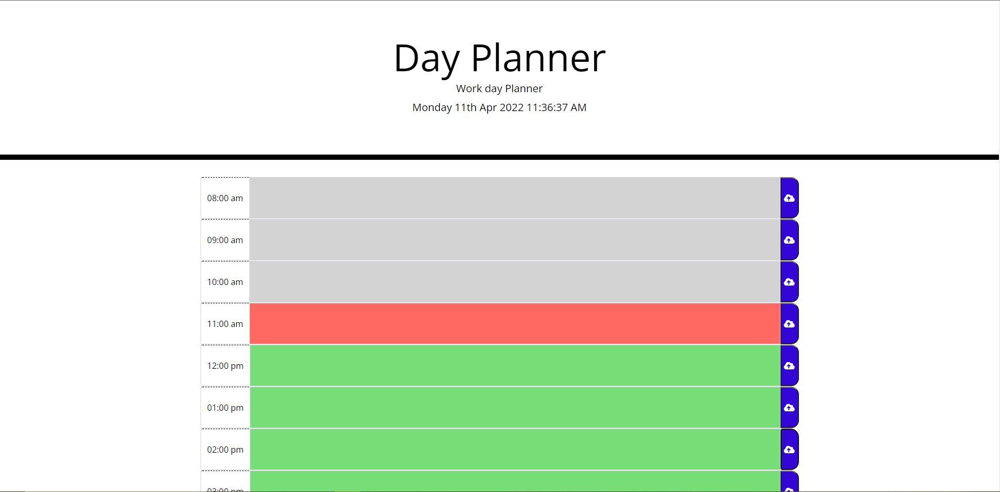

# Work-Day-Scheduler

## Website Url
https://abhi20220.github.io/Work-Day-Scheduler/

## Goals
I built this project because the client wanted to utilize third party APIS to create a work day scheduler that has the ability to store and clear data via "local storage".

## Problems and Solutions
A problem that I faced involved using moment, specifically creating a function that had the current date and time. The problem I encountered was that the code just didn't work, thankfully there were formatting methods on momentjs. Another problem I encountered was that the function for the back ground only worked if I wrote the function for both the background and when the user clicked on the button to save information to the local storage.

## Completed Requirements
```
1. When the user opens the planner they are shown the current day and time at the top of the calendar
2. When the user scrolls down they are presented with timeblocks
3. When the user views each timeblock they are able to see which timeblock is in the past(grey), present (red) and future(green)
4. When the user clicks on a timeblock they are able to enter an event
5. When the user clocks the save button for the timeblock the text is saved to local storage
6. When the user refreshes the page the saved events persist
```

## Web Page Overview
The following image shows the web page functionality and appearance with past(grey), present (red) and future (green) timeslots:



The following image shows user input when text is written within the time slots:


## Features and Points of Interests for the client

1. To get rid of text in the timeslot, clear the timeslot and then click the button to clear it
2. Current date and time is fully functional